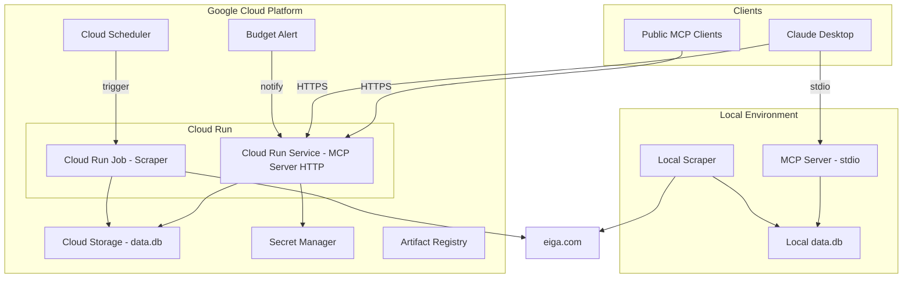
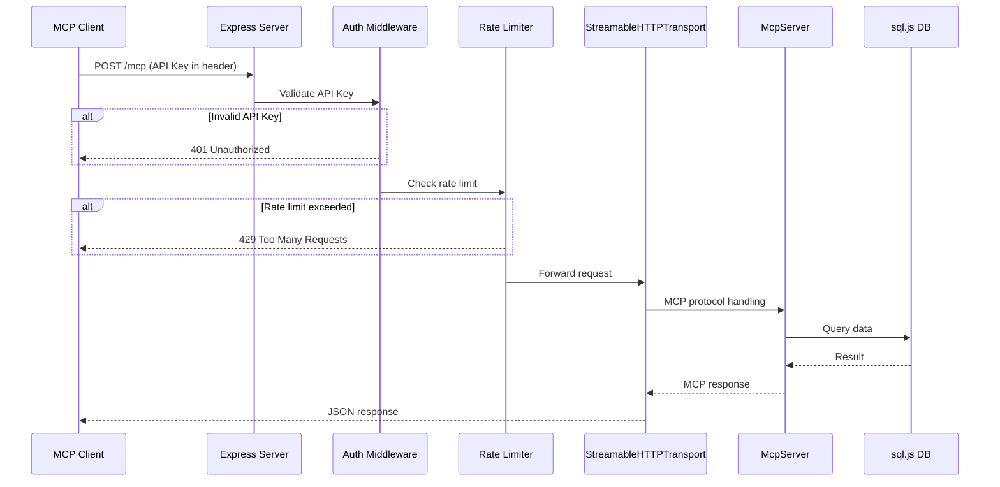
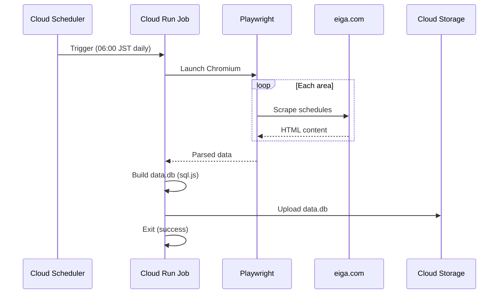
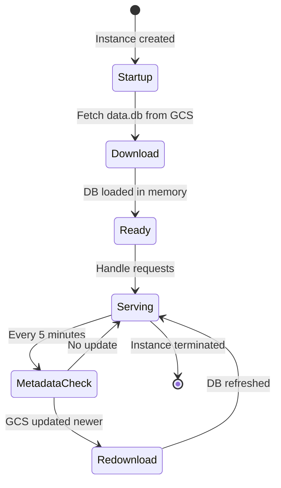

# Design Document

## Overview

**Purpose**: Cinema Scheduler MCP サーバーを Google Cloud Run にデプロイし、パブリック公開可能にする。ローカル開発環境との共存を維持しつつ、費用制御とセキュリティを確保する。

**Users**: 映画ファン（パブリック MCP クライアント経由）、開発者（ローカル stdio 経由）がそれぞれの環境から同一の MCP ツールを利用する。

**Impact**: 既存の `server.ts`（stdio）はそのまま維持。新規 `handler.ts`（HTTP）を追加。`connection.ts` に GCS 対応を追加。新規 `infra/` ディレクトリで Terraform 構成を管理。

### Goals
- ローカル版（stdio）と Cloud Run 版（HTTP）の完全な共存
- 環境変数による設定の自動切り替え（コード変更不要でデプロイ先を変更）
- max-instances + Budget Alert による費用の確実な上限制御
- API キー認証 + レート制限によるパブリック公開セキュリティ
- Docker + Terraform + GitHub Actions による本番品質の CI/CD

### Non-Goals
- カスタムドメインの設定（初回スコープ外、Cloud Run の自動 URL を使用）
- Google Sheets エクスポート機能のクラウド移行（cron パッケージは対象外）
- マルチリージョンデプロイ（asia-northeast1 単一リージョン）
- ロードバランサ / Cloud Armor の導入（max-instances で十分な規模）

## Architecture

### Existing Architecture Analysis

現在のシステムは以下の構成で動作している：

- **MCP サーバー**（`packages/mcp/`）: `StdioServerTransport` で Claude Desktop と接続。`registerTools()` でツールを登録。
- **DB 接続**（`packages/shared/`）: `openDatabase()` でローカルファイル `~/.cinema-scheduler/data.db` を sql.js で開く。`createAutoReloadProxy` でファイル変更を検知して自動リロード。
- **スクレイパー**（`packages/scraper/`）: Playwright で eiga.com からスクレイピング。結果を `saveDatabase()` でローカルファイルに保存。
- **ツール登録**（`tools/index.ts`）: `registerTools(server, db)` で全ツールを登録。McpServer と Database インスタンスを受け取るだけで、トランスポートに依存しない。

**保持すべきパターン**:
- `registerTools()` によるツール登録の一元化
- sql.js によるインメモリ SQLite
- Zod バリデーション
- モノレポ構成（pnpm workspaces + Turborepo）

### Architecture Pattern & Boundary Map



**Architecture Integration**:
- **Selected pattern**: デュアルエントリーポイント — `server.ts`（stdio）と `handler.ts`（HTTP）でトランスポートのみ分離
- **Domain boundaries**: ツールロジック（`tools/`）はトランスポートから完全に独立。DB 接続（`connection.ts`）が環境判定と切り替えを担当
- **Existing patterns preserved**: `registerTools()` パターン、sql.js インメモリ DB、Zod バリデーション
- **New components rationale**: `handler.ts`（HTTP トランスポート）、`gcs-storage.ts`（GCS 連携）、`auth.ts`（認証ミドルウェア）、`rate-limit.ts`（レート制限）
- **Steering compliance**: モノレポ構成維持、TypeScript strict mode、kebab-case ファイル命名

### Technology Stack

| Layer | Choice / Version | Role in Feature | Notes |
|-------|------------------|-----------------|-------|
| Backend | Express ^4.21 | HTTP サーバー + ミドルウェア基盤 | MCP SDK 公式サンプル準拠 |
| Backend | @modelcontextprotocol/sdk ^1.12+ | MCP プロトコル実装 | StreamableHTTPServerTransport のため要アップグレード |
| Backend | express-rate-limit ^7 | IP ベースレート制限 | インメモリストア |
| Data | @google-cloud/storage ^7 | GCS ファイルの読み書き | ADC 自動認証 |
| Data | sql.js ^1.12 | SQLite インメモリ DB | 既存維持 |
| Infrastructure | Terraform + hashicorp/google ^7.19 | GCP インフラ定義 | Cloud Run v2 リソース |
| Infrastructure | Docker | コンテナイメージ | マルチステージビルド |
| CI/CD | GitHub Actions | 自動デプロイ | Workload Identity Federation |
| CI/CD | google-github-actions/deploy-cloudrun@v3 | Cloud Run デプロイアクション | Service + Job 対応 |

## System Flows

### MCP リクエスト処理フロー（Cloud Run）



### スクレイパージョブフロー



### DB キャッシュ更新フロー



## Requirements Traceability

| Requirement | Summary | Components | Interfaces | Flows |
|-------------|---------|------------|------------|-------|
| 1.1, 1.2, 1.3, 1.4, 1.5 | デュアルトランスポート | HttpEntryPoint, ToolRegistry | Service | MCP リクエスト処理 |
| 2.1, 2.2, 2.3, 2.4, 2.5 | 環境設定切り替え | DatabaseProvider, GcsStorage | Service | DB キャッシュ更新 |
| 3.1-3.7 | Cloud Run Service 構成 | TerraformCloudRun, McpDockerfile | — | — |
| 4.1-4.5 | Cloud Run Job スクレイパー | TerraformCloudRun, ScraperDockerfile, ScraperJobRunner | Batch | スクレイパージョブ |
| 5.1-5.5 | 費用制御 | TerraformCloudRun, TerraformBudget | — | — |
| 6.1-6.5 | 認証・アクセス制御 | AuthMiddleware | Service | MCP リクエスト処理 |
| 7.1-7.4 | レート制限 | RateLimitMiddleware | Service | MCP リクエスト処理 |
| 8.1-8.5 | コンテナ・CI/CD | McpDockerfile, ScraperDockerfile, GitHubActionsWorkflow | — | — |
| 9.1-9.4 | DB 更新・キャッシュ | DatabaseProvider, GcsStorage | Service | DB キャッシュ更新 |
| 10.1-10.4 | インフラ定義 | TerraformCloudRun, TerraformBudget | — | — |

## Components and Interfaces

| Component | Domain/Layer | Intent | Req Coverage | Key Dependencies | Contracts |
|-----------|-------------|--------|--------------|-----------------|-----------|
| HttpEntryPoint | MCP / Entry | Cloud Run 用 HTTP エントリーポイント | 1.1-1.5 | Express (P0), MCP SDK (P0) | Service |
| ToolRegistry | MCP / Core | 既存ツール登録ロジック（変更なし） | 1.2 | McpServer (P0), Database (P0) | — |
| DatabaseProvider | Shared / Data | 環境に応じた DB ソース切り替え | 2.1-2.5, 9.1-9.4 | GcsStorage (P1), sql.js (P0) | Service |
| GcsStorage | Shared / Infra | GCS ファイルの読み書き | 2.2, 4.2, 9.1-9.3 | @google-cloud/storage (P0) | Service |
| AuthMiddleware | MCP / Security | API キー認証 | 6.1-6.5 | Secret Manager (P1) | Service |
| RateLimitMiddleware | MCP / Security | IP ベースレート制限 | 7.1-7.4 | express-rate-limit (P0) | Service |
| ScraperJobRunner | Scraper / Entry | Cloud Run Job 用スクレイパーエントリーポイント | 4.1-4.5 | Scraper (P0), GcsStorage (P0) | Batch |
| McpDockerfile | Infra / Container | MCP サーバーコンテナイメージ | 3.7, 8.1-8.2 | — | — |
| ScraperDockerfile | Infra / Container | スクレイパーコンテナイメージ | 4.1, 8.1, 8.3 | — | — |
| TerraformCloudRun | Infra / IaC | Cloud Run + 関連リソースの Terraform 定義 | 3.1-3.6, 4.3-4.5, 5.1-5.2, 10.1-10.4 | hashicorp/google (P0) | — |
| TerraformBudget | Infra / IaC | Budget Alert + 自動停止の Terraform 定義 | 5.3-5.5, 10.4 | hashicorp/google (P0) | — |
| GitHubActionsWorkflow | Infra / CI/CD | CI/CD ワークフロー定義 | 8.4-8.5 | deploy-cloudrun@v3 (P0) | — |

### MCP / Entry Layer

#### HttpEntryPoint

| Field | Detail |
|-------|--------|
| Intent | Cloud Run 環境向けの HTTP エントリーポイント。Express サーバーを起動し、MCP プロトコルを HTTP 経由で提供 |
| Requirements | 1.1, 1.3, 1.5 |

**Responsibilities & Constraints**
- Express HTTP サーバーの起動とライフサイクル管理
- StreamableHTTPServerTransport のセッション管理
- ミドルウェアチェーンの構成（CORS → Auth → RateLimit → MCP）
- `PORT` 環境変数の読み取り（デフォルト: 8080）
- ヘルスチェックエンドポイント（`GET /health`）の提供

**Dependencies**
- Outbound: DatabaseProvider — DB 接続取得 (P0)
- Outbound: ToolRegistry — ツール登録 (P0)
- Outbound: AuthMiddleware — 認証 (P1)
- Outbound: RateLimitMiddleware — レート制限 (P1)
- External: Express ^4.21 — HTTP サーバー (P0)
- External: @modelcontextprotocol/sdk — StreamableHTTPServerTransport (P0)

**Contracts**: Service [x]

##### Service Interface
```typescript
interface HttpEntryPointConfig {
  port: number;
  corsOrigins: string[];
  enableAuth: boolean;
  enableRateLimit: boolean;
}

// handler.ts のエクスポート
function startHttpServer(config: HttpEntryPointConfig): Promise<void>;
```
- Preconditions: `PORT` 環境変数が設定されている、または 8080 がバインド可能
- Postconditions: HTTP サーバーが指定ポートでリッスン中
- Invariants: MCP プロトコルバージョンの互換性が維持される

**Implementation Notes**
- Express のルーティング: `POST /mcp`（MCP リクエスト）、`GET /mcp`（SSE）、`DELETE /mcp`（セッション終了）、`GET /health`（ヘルスチェック）
- `StreamableHTTPServerTransport` はリクエストごとに生成し、セッション ID で管理
- SIGTERM ハンドラでグレースフルシャットダウン
- ヘルスチェック（`GET /health`）: DB ロード完了時に `200 OK`、未完了時に `503 Service Unavailable` を返却。Cloud Run の Startup probe として使用し、GCS からの DB ダウンロード完了前にリクエストが到達するのを防止

### Shared / Data Layer

#### DatabaseProvider

| Field | Detail |
|-------|--------|
| Intent | 環境に応じて DB ソース（ローカルファイル or GCS）を自動切り替えし、キャッシュ管理を行う |
| Requirements | 2.1, 2.2, 2.3, 2.4, 2.5, 9.1, 9.2, 9.3, 9.4 |

**Responsibilities & Constraints**
- `CLOUD_STORAGE_BUCKET` 環境変数による環境判定
- ローカル: 既存の `openDatabase()` + `createAutoReloadProxy` を使用
- Cloud Run: GCS からダウンロード → sql.js でメモリ上に展開
- メタデータチェックによる定期的なキャッシュ更新（5分間隔）
- `connection.ts` 内に集約（既存関数の拡張）

**Dependencies**
- Outbound: GcsStorage — GCS ファイル操作 (P1, Cloud Run 環境のみ)
- External: sql.js ^1.12 — SQLite エンジン (P0)

**Contracts**: Service [x]

##### Service Interface
```typescript
interface DatabaseProviderOptions {
  readonly?: boolean;
  gcsBucket?: string;        // CLOUD_STORAGE_BUCKET
  gcsObjectName?: string;    // デフォルト: 'data.db'
  cacheCheckInterval?: number; // デフォルト: 300000 (5分)
}

// connection.ts の拡張エクスポート
function openDatabase(options?: DatabaseProviderOptions): Promise<Database>;
function openDatabaseFromGcs(bucket: string, objectName: string): Promise<Database>;
```
- Preconditions: sql.js WASM が初期化可能、GCS バケットが存在する（Cloud Run 環境のみ）
- Postconditions: Database インスタンスがクエリ可能な状態
- Invariants: メモリ上の DB は常に整合性のある状態（部分ダウンロードなし）

#### GcsStorage

| Field | Detail |
|-------|--------|
| Intent | Google Cloud Storage との読み書き操作を抽象化 |
| Requirements | 2.2, 4.2, 9.1, 9.2, 9.3 |

**Responsibilities & Constraints**
- GCS からのファイルダウンロード（Buffer として）
- GCS へのファイルアップロード（Buffer から）
- オブジェクトメタデータの取得（更新日時）
- ADC による自動認証（Cloud Run 環境では追加設定不要）

**Dependencies**
- External: @google-cloud/storage ^7 — GCS クライアント (P0)

**Contracts**: Service [x]

##### Service Interface
```typescript
interface GcsStorageService {
  download(bucket: string, objectName: string): Promise<Buffer>;
  upload(bucket: string, objectName: string, data: Buffer): Promise<void>;
  getMetadata(bucket: string, objectName: string): Promise<{ updated: Date; generation: string }>;
}
```
- Preconditions: バケットが存在し、サービスアカウントにアクセス権がある
- Postconditions: ダウンロードは完全なファイル内容を返す、アップロードはオブジェクトが作成される
- Invariants: GCS 操作は冪等（同じデータのアップロードは同じ結果）

### MCP / Security Layer

#### AuthMiddleware

| Field | Detail |
|-------|--------|
| Intent | API キーによる HTTP リクエストの認証 |
| Requirements | 6.1, 6.2, 6.3, 6.4, 6.5 |

**Responsibilities & Constraints**
- `Authorization: Bearer <api-key>` ヘッダーの検証
- API キーの取得元: 環境変数 `API_KEYS`（カンマ区切り）または GCP Secret Manager
- stdio 環境ではスキップ（HTTP エントリーポイントでのみ使用）
- CORS ヘッダーの設定

**Dependencies**
- External: GCP Secret Manager — API キー保管 (P1, 本番環境)

**Contracts**: Service [x]

##### Service Interface
```typescript
interface AuthConfig {
  apiKeys: string[];            // 有効な API キーのリスト
  corsOrigins: string[];        // 許可するオリジン
  bypassPaths: string[];        // 認証をスキップするパス (例: ['/health'])
}

// Express ミドルウェア
function createAuthMiddleware(config: AuthConfig): express.RequestHandler;
function createCorsMiddleware(origins: string[]): express.RequestHandler;
```
- Preconditions: API キーが1つ以上設定されている
- Postconditions: 無効な API キーのリクエストは 401 で拒否される
- Invariants: ヘルスチェックパスは常にアクセス可能

#### RateLimitMiddleware

| Field | Detail |
|-------|--------|
| Intent | IP アドレスベースのリクエストレート制限 |
| Requirements | 7.1, 7.2, 7.3, 7.4 |

**Responsibilities & Constraints**
- IP アドレスごとのリクエスト数を時間窓で制限
- 設定値は環境変数で外部化: `RATE_LIMIT_MAX`、`RATE_LIMIT_WINDOW_MS`
- stdio 環境では適用しない

**Dependencies**
- External: express-rate-limit ^7 — レート制限ライブラリ (P0)

**Contracts**: Service [x]

##### Service Interface
```typescript
interface RateLimitConfig {
  windowMs: number;   // 時間窓（ミリ秒）。デフォルト: 900000 (15分)
  max: number;        // 時間窓あたりの最大リクエスト数。デフォルト: 100
}

function createRateLimitMiddleware(config: RateLimitConfig): express.RequestHandler;
```

### Scraper / Entry Layer

#### ScraperJobRunner

| Field | Detail |
|-------|--------|
| Intent | Cloud Run Job 用のスクレイパーエントリーポイント。スクレイピング完了後に data.db を GCS にアップロード |
| Requirements | 4.1, 4.2, 4.5 |

**Responsibilities & Constraints**
- 既存のスクレイパーロジックを呼び出し
- スクレイピング結果を sql.js で data.db に構築
- 完成した data.db を GCS にアップロード
- エリア設定は環境変数 `SCRAPE_AREAS` で指定可能

**Dependencies**
- Outbound: GcsStorage — GCS アップロード (P0)
- Outbound: @cinema-scheduler/scraper — スクレイピングロジック (P0)

**Contracts**: Batch [x]

##### Batch / Job Contract
- **Trigger**: Cloud Scheduler（毎日 06:00 JST）
- **Input / validation**: 環境変数 `CLOUD_STORAGE_BUCKET`（必須）、`SCRAPE_AREAS`（任意）
- **Output / destination**: `gs://{bucket}/data.db`
- **Idempotency & recovery**: 同日の再実行は GCS 上の data.db を上書き。最大3回リトライ。

### Infra / Container Layer

#### McpDockerfile

| Field | Detail |
|-------|--------|
| Intent | MCP サーバーの最小コンテナイメージ |
| Requirements | 3.7, 8.1, 8.2 |

**Implementation Notes**
- マルチステージビルド: Stage 1（ビルド: pnpm install + tsc）、Stage 2（実行: node:20-slim + dist のみ）
- 最終イメージに devDependencies を含めない
- `PORT=8080` をデフォルト環境変数として設定
- `USER node` で非 root 実行

#### ScraperDockerfile

| Field | Detail |
|-------|--------|
| Intent | Playwright + Chromium を含むスクレイパーコンテナイメージ |
| Requirements | 4.1, 8.1, 8.3 |

**Implementation Notes**
- ベース: `node:20-bookworm`（Playwright の依存関係に対応）
- `RUN npx playwright install --with-deps chromium`（Chromium のみインストール）
- 非 root ユーザーでの実行

### Infra / IaC Layer

#### TerraformCloudRun

| Field | Detail |
|-------|--------|
| Intent | Cloud Run Service/Job + 関連 GCP リソースの Terraform 定義 |
| Requirements | 3.1-3.6, 4.3-4.5, 5.1-5.2, 10.1-10.4 |

**Implementation Notes**
- ファイル構成: `infra/main.tf`、`infra/variables.tf`、`infra/outputs.tf`、`infra/terraform.tfvars`
- `google_cloud_run_v2_service`: MCP サーバー（max_instance_count=3、min_instance_count=0、max_instance_request_concurrency=80、timeout="30s"、startup_cpu_boost=true、deletion_protection=true）
  - Startup probe: HTTP GET `/health`（initial_delay_seconds=2、period_seconds=3、failure_threshold=10）— GCS ダウンロード完了を確認してからトラフィックを受付
- `google_cloud_run_v2_job`: スクレイパー（max_retries=3）
- `google_cloud_scheduler_job`: 毎日 06:00 JST トリガー（`oauth_token` でサービスアカウント認証、URI は Cloud Run Jobs v2 API エンドポイント）
- `google_storage_bucket`: data.db 保管
- `google_artifact_registry_repository`: Docker イメージ保管
- `google_secret_manager_secret`: API キー保管
- IAM: Cloud Run Service Account → GCS 読み取り + Secret Manager アクセス（`roles/storage.objectViewer`、`roles/secretmanager.secretAccessor`）
- IAM: Cloud Scheduler Service Account → Cloud Run Job 起動（`roles/run.invoker`）

#### TerraformBudget

| Field | Detail |
|-------|--------|
| Intent | GCP Budget Alert + 通知の Terraform 定義 |
| Requirements | 5.3, 5.4, 5.5, 10.4 |

**Implementation Notes**
- `google_billing_budget`: 閾値をパラメータ化（デフォルト: ¥1,000）
- Pub/Sub トピックへの通知設定（メール + Pub/Sub）
- **Phase 1（初回スコープ）**: 閾値超過時は通知のみ。費用の物理的上限は max-instances=3 で保証
- **Phase 2（将来拡張）**: Pub/Sub → Cloud Run function → Cloud Run Admin API でトラフィックを 0% に変更する自動停止機構を追加
- **注意**: Google 公式ドキュメントによると Budget Alert は通知専用であり、直接的な課金停止機能はない。また課金の遅延により閾値超過後も追加コストが発生する可能性がある

### Infra / CI/CD Layer

#### GitHubActionsWorkflow

| Field | Detail |
|-------|--------|
| Intent | main ブランチへの push 時に自動ビルド・デプロイ |
| Requirements | 8.4, 8.5 |

**Implementation Notes**
- `.github/workflows/deploy.yml`
- 2つのジョブ: `deploy-mcp`（MCP サーバー）、`deploy-scraper`（スクレイパー Job）
- `google-github-actions/auth@v3` で Workload Identity Federation 認証
- `google-github-actions/deploy-cloudrun@v3` でデプロイ
- Docker イメージのタグ: `${{ github.sha }}`

## Data Models

### Domain Model

既存のデータモデル（theaters, movies, showtimes, scrape_logs）に変更なし。data.db の物理ファイルが GCS に移動するのみ。

### Data Contracts & Integration

**GCS オブジェクト構造**:
- バケット: `cinema-scheduler-{project_id}`
- オブジェクト: `data.db`（SQLite バイナリ）
- メタデータ: `updated`（最終更新日時）、`generation`（バージョン番号）

**環境変数コントラクト**:

| 変数名 | 必須 | デフォルト | 説明 |
|--------|:---:|-----------|------|
| `PORT` | — | `8080` | HTTP ポート（Cloud Run が自動設定） |
| `CLOUD_STORAGE_BUCKET` | — | — | GCS バケット名（設定時は Cloud Run モード） |
| `API_KEYS` | — | — | API キー（カンマ区切り） |
| `RATE_LIMIT_MAX` | — | `100` | 時間窓あたりの最大リクエスト数 |
| `RATE_LIMIT_WINDOW_MS` | — | `900000` | レート制限の時間窓（ミリ秒） |
| `CORS_ORIGINS` | — | `*` | 許可するオリジン（カンマ区切り） |
| `SCRAPE_AREAS` | — | — | スクレイピング対象エリア（カンマ区切り） |
| `DB_CACHE_CHECK_INTERVAL` | — | `300000` | GCS メタデータチェック間隔（ミリ秒） |

## Error Handling

### Error Categories and Responses

**User Errors (4xx)**:
- `401 Unauthorized` — API キーが無効または欠如 → レスポンスに認証方法を記載
- `429 Too Many Requests` — レート制限超過 → `Retry-After` ヘッダーを付与
- `400 Bad Request` — MCP プロトコルエラー → エラー詳細を JSON で返却

**System Errors (5xx)**:
- `503 Service Unavailable` — DB ダウンロード失敗 → リトライ後にエラーレスポンス
- `500 Internal Server Error` — 予期しないエラー → エラーログ出力、クライアントには汎用メッセージ

**Batch Job Errors**:
- スクレイピング失敗 → Cloud Run Job の組み込みリトライ（最大3回）
- GCS アップロード失敗 → リトライ後に Job 失敗としてマーク

### Monitoring
- Cloud Run の組み込みログ（Cloud Logging に自動送信）
- `console.error` で出力した内容は Cloud Logging に記録される
- ヘルスチェック: `GET /health` → `200 OK`（DB ロード状態を含む）

## Testing Strategy

### Unit Tests
- `DatabaseProvider`: ローカル/GCS モードの切り替えロジック
- `AuthMiddleware`: API キーの検証、バイパスパス
- `RateLimitMiddleware`: 制限超過時の 429 レスポンス
- `GcsStorage`: ダウンロード/アップロード/メタデータ取得（モック）

### Integration Tests
- `HttpEntryPoint` + `AuthMiddleware` + `RateLimitMiddleware`: Express サーバーの統合テスト
- `DatabaseProvider` + `GcsStorage`: GCS からの DB ロードとキャッシュ更新
- `ScraperJobRunner` + `GcsStorage`: スクレイピング結果の GCS アップロード

### Infrastructure Tests
- Terraform `validate` + `plan`: 構成の妥当性確認
- Docker ビルド: MCP サーバーとスクレイパーのイメージビルド成功確認

## Security Considerations

- **API キー管理**: GCP Secret Manager に保管。環境変数での直接設定も可能（開発用）
- **最小権限の原則**: Cloud Run サービスアカウントに GCS 読み取り + Secret Manager アクセスのみ付与
- **読み取り専用 DB**: MCP サーバーは DB に書き込まない（既存設計を維持）
- **入力検証**: Zod スキーマによるバリデーション（既存設計を維持）
- **Workload Identity Federation**: GitHub Actions からの認証にサービスアカウントキーを使用しない
- **非 root コンテナ**: Docker イメージは非 root ユーザーで実行

## Performance & Scalability

- **コールドスタート目標**: 3秒以下（Startup CPU Boost 有効化、data.db が 5MB 以下の前提）
- **同時リクエスト処理**: 1インスタンスあたり最大80リクエスト（`max_instance_request_concurrency: 80`、Cloud Run デフォルト値。Node.js の async I/O により I/O-bound な MCP リクエストを効率的に並行処理）
- **最大スループット**: 3インスタンス × 80並行 = 240同時リクエスト
- **DB サイズ監視**: data.db が 10MB を超えた場合はスクレイピング対象エリアの見直しを検討
- **スケールtoゼロ**: アイドル時は課金ゼロ。初回リクエスト時にコールドスタート
